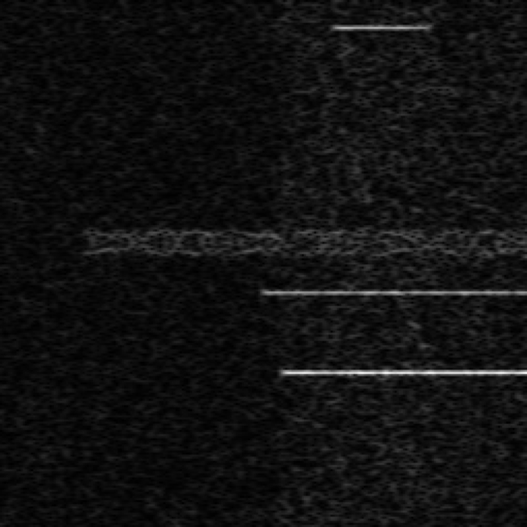
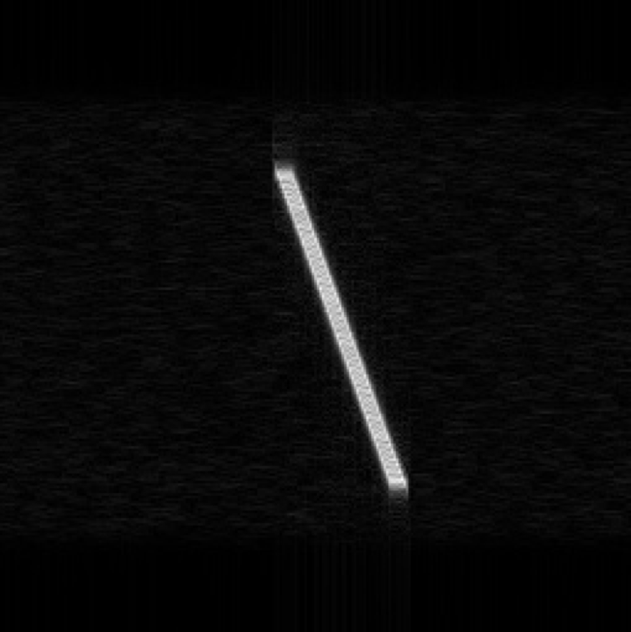
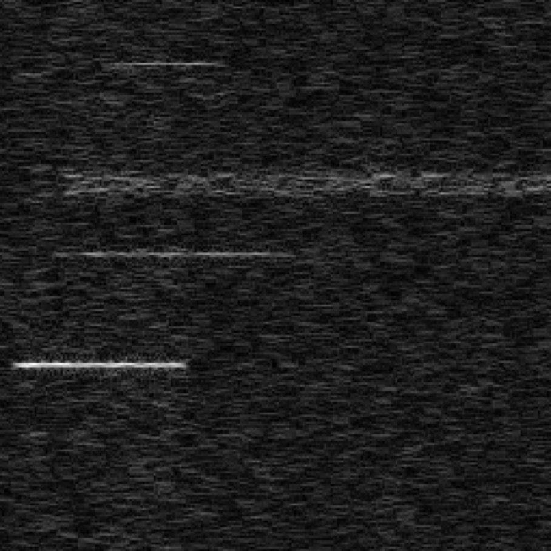

# Time-Frequency Deep Spectral Detector (2015)

This is the base notebook I created for the 2014/2015 tutorial on deep learning for RF signal detection that was used by NVidia for the early GTC course on same topic and on NVidia online course site during 2015-2018 time-frame. At the time, I was co-founder of the tech startup KickView Corporation, an early NVidia inception partner. 

## About
This tutorial introduces some basic methods for utilizing a Convolutional Neural Network (CNN) to process spectrograms created from Radio Frequency (RF) data. This tutorial was provided to NVidia Corporation in 2015 and has been used in their enterprise training tutorial series for several years. This version removes the dependency on DIGITS and uses only Keras and Tensorflow.

## Introduction to signal detection

When monitoring radio frequency (RF) signals, or similar signals from sensors such as biomedical, temperature, etc., we are often interested in detecting certain signal “markers” or features. This can become a challenging problem when the signal-of-interest is degraded by noise. Traditional signal detection methods use a range of techniques such as energy detection, matched filtering, or other correlation-based processing techniques. Short-duration radio frequency (RF) events can be especially challenging to detect, since the useful data length is limited and long integration times are not possible. Weak signals that are short in duration are some of the most difficult to reliably detect (or even find). We will walk you through a simple approach using a Convolutional Neural Network (CNN) to tackle the traditional signal processing problem of detecting RF signals in noise.

## A little background information

Signal detection theory often assumes that a signal is corupted with additive white Gaussian noise (AWGN). This type of noise is common in the real world and the assumption makes mathematical analysis tractable. The detection of a signal in noise depends on the signal duration, amplitude, and the corresponding noise process. This becomes more difficult if correlated noise, or interfering signals, are also in the same band as the signal you wish to detect.

In this tutorial, we will assume no a-priori information about the parameters for the signal-of-interest. As input to the Convolutional Neural Network, we will utilize spectrograms computed from simulated Radio Frequency (RF) data using a common Fast Fourier Transform (FFT) based method. Taking the input data into the frequency domain as time-frequency grams, which are 2D representations just like images, allows us to visualize the energy of a signal over some pre-determined time duration and frequency bandwidth.

## The difficulty with real-world signals

For a single sinusoid in AWGN, finding the frequency bin with the maximum amplitude is a method for estimating signal frequency in a spectrogram. But real-world signals are often more complex, with frequency components that change with time, and creating a generalized signal detection algorithm becomes difficult. In this tutorial, we will look at one of these types of signals - Linear Frequency-Modulated (LFM) signals. In a follow-on tutorial we will explore Frequency-Hopped (FH) signals and multi-signal detection scenarios.

## Linear Frequency-Modulated Signals

A linear frequency-modulated (LFM), or chirp, signal is a signal that ramps up or down in frequency over some time frame. Its frequency changes with time based on its chirp rate. Chirps are used in many different systems for frequency response measurements and timing. RADAR systems use chirp signals due to the inherent large time-bandwith product available with coherent processing. Another common use is for automatic room equalization in home theater receivers, since chirps can excite a large frequency swath quickly. Chirps can also be used as “pilot” signals to denote the start of an incoming transmission, and more.

Figure 1 shows a high-SNR chirp as seen in a grayscale spectrogram (the format we will be using). Since the spectrogram consists of real numbers all > 0, we can map it to an image file by scaling the values appropriately. So we only need a single grayscale image channel. In this plot, the x axis is time and the y axis is frequency. Brightness is proportional to signal power.

The above chirp (Figure 1) has a high SNR and is easy to detect with traditional signal processing algorithms. But when the environment contains other signals and noise, reliable detection becomes more difficult. Figure 2 shows an example spectrogram with some pulsed carrier waves (sinusoids) and a low-bitrate digital communication BPSK signal embedded in noise.

Fig2. Multiple signals and noise (x-axis is time, y-axis is frequency).

In Figure 2 there is no chirp signal, just noise and other signals. This is similar to what “real-world” RF signals look like – combinations of signal classes with different strengths, all embedded in noise. Figure 3 consists of another spectrogram showing noise, interfering signals, and a weak chirp signal.

Fig3. Weak chirp embedded in noise with other signals (x-axis is time, y-axis is frequency).

In Figure 3 the chirp signal is several dB below the noise power in this frequency band. In fact, the signal-to-noise-ratio (SNR) for the chirp is -7 dB. Note that it is barely visible to the human eye. Traditional detection methods, without large amounts of integration and/or a prior signal information, fail consistently in detecting a weak signal like this. Moreover, since we have interfering signals that are sharing the same bandwidth as the chirp, the problem becomes even harder.
W
## What is this good for?

When monitoring RF signals, we want accurate detection of these types of signals, as a human cannot visually inspect all the data manually. For example, in the case of intelligent spectral monitoring or cognitive radio, we want something to autonomously analyze extraordinary amounts of signal data all the time. The question arises: Can we design a better process to help detect these weak signals?

